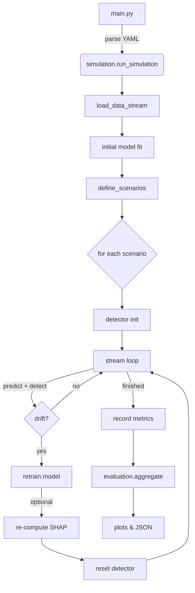

# SHAP-Enhanced Unsupervised Drift Detection: A Model-Agnostic Extension Framework
A **model‑agnostic extension framework** for detecting and responding to concept drift in data streams while minimising costly retraining.

---

## Key Features

| Capability                                       | Description                                                                                                                 |
|--------------------------------------------------|-----------------------------------------------------------------------------------------------------------------------------|
| **Model‑agnostic SHAP enhanced drift detectors** | Plug‑in implementations of D3, DAWIDD, HDDDM and Student‑Teacher (STUDD) algorithms with SHAP feature selection enhancement ||
| **Flexible experiment runner**                   | YAML‑driven pipeline that sweeps datasets, models and drift scenarios, logging full accuracy curves                         |
| **Rich evaluation suite**                        | JSON summaries, Matplotlib plots and Pandas aggregation helpers for quick insight                                           |
| **Synthetic drift injection**                    | Utilities to inject controllable, class‑conditional drift for offline experimentation                                       |

---

## Repository Layout

```
├── src/                       # All source code
│   ├── data_loader.py         # Dataset readers & stream loader
│   ├── simulation.py          # Experiment orchestrator
│   ├── evaluation.py          # Aggregation & plotting helpers
│   ├── shap_utils.py          # SHAP explainer helpers
│   ├── utils/                 # Misc utilities (drift injection, etc.)
│   ├── detectors/             # Drift detector implementations
│   │   ├── D3/
│   │   ├── DAWIDD/
│   │   ├── HDDDM/
│   │   └── STUDD/
│   └── models/                # Sklearn‑compatible wrappers
│       ├── base_model.py
│       ├── logistic_regression.py
│       ├── random_forest.py
│       └── mlp.py
├── data/                      # Benchmark datasets
├── config.yaml                # Single entry‑point configuration file
├── main.py                    # CLI to run full experiment pipeline
└── paper/                     # paper source 
```

## Code Architecture & Flow

The project is organised around a **single YAML‑driven simulation loop** that stitches together datasets, base models, drift detectors and SHAP‑based feature selection.

### 1. Execution pipeline



*The mermaid diagram (rendered on GitHub) shows the high‑level control flow.*

### 2. Key modules

| Module                             | Purpose                                                                                                                                 |
| ---------------------------------- | --------------------------------------------------------------------------------------------------------------------------------------- |
| **`src/simulation.py`**            | Core orchestrator that instantiates detectors, runs the streaming loop, manages retraining and SHAP refreshes                           |
| **`src/detectors/`**               | Independent, plug‑and‑play implementations of D3, DAWIDD, HDDDM and STUDD, each exposing a minimal `add_record` / `detected_change` API |
| **`src/models/`**                  | Thin wrappers around scikit‑learn estimators that unify `fit / predict / predict_proba` and track a `fitted` flag                       |
| **`src/shap_utils.py`**            | Helper factory that auto‑selects the correct SHAP explainer (Tree, Linear or Kernel) and returns top‑k important feature indices        |
| **`src/utils/drift_injection.py`** | Optional functions to inject synthetic, class‑conditional drift by swapping feature pairs                                               |
| **`src/evaluation.py`**            | Aggregates per‑scenario results, writes summary JSON and draws Seaborn accuracy plots                                                   |

### 3. Extending the framework

1. **Add a new detector**
   Drop a folder under `src/detectors/YourMethod/`, implement a class with `add_record` + `detected_change`, and register it in `define_scenarios()`.
2. **Plug in a different model**
   Write a new wrapper in `src/models/`, inherit from `BaseModel`, and reference its name in `config.yaml`.
3. **Alternate feature‑selection**
   `shap_utils.select_important_features()` currently supports *top‑k*.

---

## Installation

```bash
# 1. Clone repository
$ git clone https://github.com/Qehbr/SHAP-Enhanced-Unsupervised-Drift-Detection.git
$ cd SHAP-Enhanced-Unsupervised-Drift-Detection

# 2. (Recommended) create virtual environment
$ python -m venv venv && source venv/bin/activate

# 3. Install dependencies
$ pip install -r requirements.txt
```

---

## Quick Start

1. **Clone the repo**.
2. **Edit `config.yaml`** to choose datasets, models, detectors and SHAP hyper‑parameters.
   *Enable or disable individual detectors with the `enabled` flags.*
3. **Run the simulation**

```bash
$ python main.py --config config.yaml
```

4. **Inspect results** in `results/`:

   * raw JSON logs (`*_raw.json`)
   * aggregated summaries (`*_summary_scenarios.json`)
   * accuracy comparison plots for every dataset / model / detector family.

---

## Configuration Highlights (`config.yaml`)

```yaml
random_seed: 42
output_dir: "results/"

# Datasets
- name: "electricity"
  initial_train_size: 1000
  retrain_window_size: 1000
  shap_k: 4            # top‑k features to track

# Models
- name: "RandomForest"
  params:
    n_estimators: 10

# Detectors → per‑detector params + optional SHAP variant
student_teacher:
  enabled: true
  params:
    student_model_name: "LogisticRegression"
    adwin_delta: 1e‑5
  shap_variant:
    enabled: true
```

*See inline comments in the file for full detail.*

---

## Reproducing Paper Experiments

Our paper reports results on **Electricity**, **Weather** and **Forest Cover** datasets with logistic regression, random forest and MLP backbones.
To replicate:

```bash
$ python main.py --config config.yaml # Update config file with relevant datasets, detectors, models
```

Modify `datasets[*].drift` to `true` if you also want synthetic drift injection during evaluation.

---

## Interpreting the Outputs

* `*_summary_scenarios.json` – mean final accuracy, mean retraining count and run‑time per scenario.
* PNG plots – overlayed accuracy vs. processed instances, comparing **baseline**, **standard** and **SHAP** variants.

An example excerpt:

```json
{
  "electricity": {
    "RandomForest": {
      "ST_shap": {
        "retraining_counts": 3.4,
        "final_accuracy": 0.87
      }
    }
  }
}
```

---

## Citation (In Future)

If you use this codebase, please cite our paper:

```bibtex
@inproceedings{TODO,
  title     = {SHAP‑Enhanced Unsupervised Drift Detection: A Model‑Agnostic Extension Framework},
  author    = {Rusanov, Yuriy and Orpaz, Elad},
  year      = {2025}
}
```

---

## License

Distributed under the **MIT License**.  See `LICENSE` for more information.

---

## ✉️ Contact

*Yuriy Rusanov* – [rusanov@post.bgu.ac.il](mailto:rusanov@post.bgu.ac.il)

*Elad Orpaz* – [eladorp@post.bgu.ac.il](mailto:eladorp@post.bgu.ac.il)

